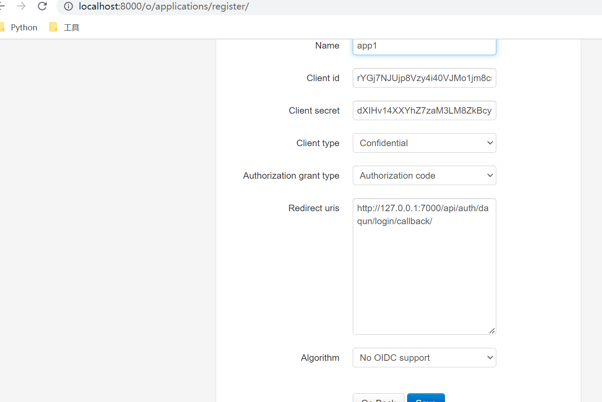
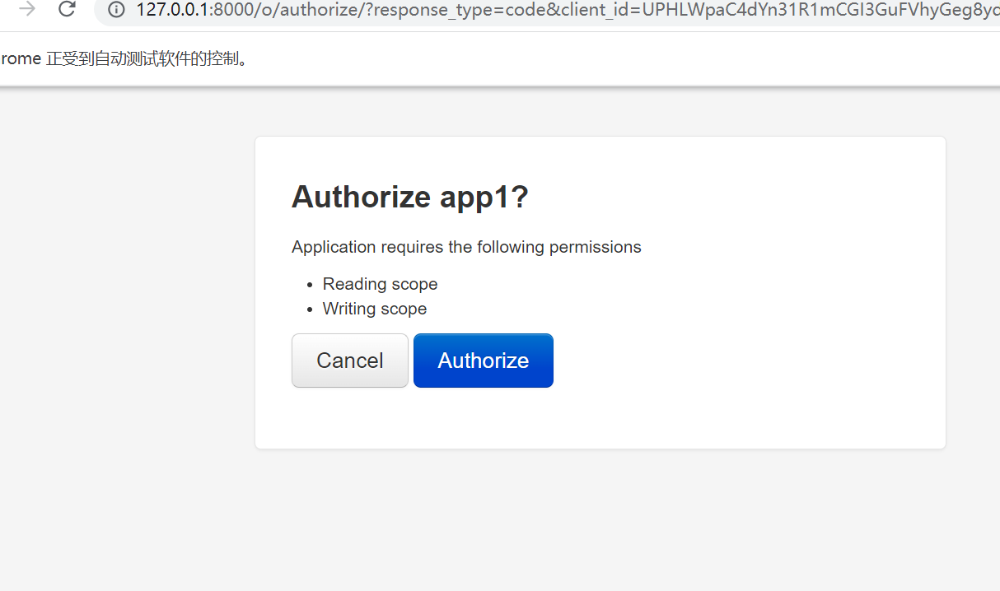

# 1. 启动环境准备

* 删除db.sqlite3文件

  ```
  rm -f db.sqlite3
  ```

* 安装依赖

  ```
  pip install -r requirements.txt
  ```
* 重新迁移文件

  ```
  python manage.py migrate
  ```
* 启动服务

  ```
  python manage.py runserver
  ```
# 2. 授权三方网站访问 oauth2

具体oauth server配置参见: https://django-oauth-toolkit.readthedocs.io/en/1.7.1/getting_started.html#authorization-code

* 创建可以登录的用户

  ```
  python manage.py createsuperuser
  这里创建的
  用户: admin
  密码: aaa1111
  ```
  
* 访问已经授权的application

  ```
  http://localhost:8000/o/applications/register
  ```
  
* 为app授权

  ```shell
  # 这里为了方便测试, 强制将私密信息设置如下:
  client_id: UPHLWpaC4dYn31R1mCGI3GuFVhyGeg8yd5verM0M
  client_secret: HIFKpn4xDklni6Ajeby9UgRlsKHbGcBCXNbtZjWtBKeaFSkGJ9MkgSWUg4cf4HLg7zAcxnZxDwXGjgn1NJ4qJmtflxSdC7D9gKjFD6kEYP7wh4s1nKS4uEOh6AU5AO0u
  redirect_uri: http://127.0.0.1:7000/api/auth/daqun/login/callback/
  ```

  

# 3. 客户端验证

* 修改`auth_connect.py`中的参数client_id, client_secret, redirect_uri为自己设置的值

* 直接运行此脚本, 将会弹出浏览器验证页面, 输入账号密码登录, 输入后, 将会提示是否授权登录三方网站, 点击后, 将获取到下发的code令牌, 浏览器会自动关闭

  

* 根据获取到的code, 请求auth server获取用于

  * 接口认证时候校验的access_token
  * 当access_token过期时, 重新生成access_token的refresh_token

* 拿到access_token后, 即可向auth server 发起请求获取用户信息, 或者其他api信息